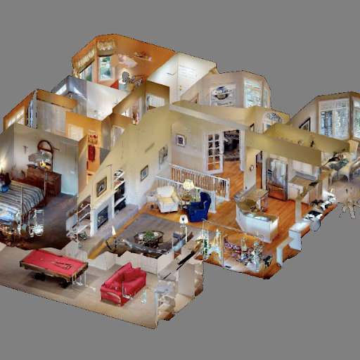

# Habitat - Matterport 3D Research Dataset

Matterport and Facebook AI Research are collaborating to release the world's largest dataset of 3D spaces. This is available exclusively for academic, non-commercial uses. The Habitat-Matterport 3D Research Dataset (HM3D) is an unprecedented collection of high-resolution Matterport digital twins made up of residential, commercial, and civic spaces.

The dataset consists of 3D Meshes & Textures of 1,000 Matterport spaces and includes:
-   3D mesh file (OBJ & GLB)
-   JPG texture map image files
-   MTL file

Here’s a preview of selected spaces that are part of this library,

  
   

Access and use of the dataset are subject to the following [Terms & Conditions](https://matterport.com/matterport-end-user-license-agreement-academic-use-model-data)

## 🆕 Downloading HM3D v0.2
|File Name|Data Set|Format|Link|Size|
|--|--|--|--|--|
|hm3d-minival-glb-v0.2.tar|minival|glb| https://api.matterport.com/resources/habitat/hm3d-minival-glb-v0.2.tar |464M|
|hm3d-minival-habitat-v0.2.tar|minival|habitat|https://api.matterport.com/resources/habitat/hm3d-minival-habitat-v0.2.tar |390M|
|hm3d-minival-semantic-annots-v0.2.tar|minival|semantic-annots| https://api.matterport.com/resources/habitat/hm3d-minival-semantic-annots-v0.2.tar |240.6M|
|hm3d-minival-semantic-configs-v0.2.tar|minival|semantic-configs| https://api.matterport.com/resources/habitat/hm3d-minival-semantic-configs-v0.2.tar |30K|
|hm3d-train-glb-v0.2.tar|train|glb| https://api.matterport.com/resources/habitat/hm3d-train-glb-v0.2.tar |32G|
|hm3d-train-habitat-v0.2.tar|train|habitat|https://api.matterport.com/resources/habitat/hm3d-train-habitat-v0.2.tar |27G|
|hm3d-train-semantic-annots-v0.2.tar|train|semantic-annots| https://api.matterport.com/resources/habitat/hm3d-train-semantic-annots-v0.2.tar |8.1G|
|hm3d-train-semantic-configs-v0.2.tar|train|semantic-configs| https://api.matterport.com/resources/habitat/hm3d-train-semantic-configs-v0.2.tar |50K|
|hm3d-val-glb-v0.2.tar|val|glb| https://api.matterport.com/resources/habitat/hm3d-val-glb-v0.2.tar |4G|
|hm3d-val-habitat-v0.2.tar|val|habitat|https://api.matterport.com/resources/habitat/hm3d-val-habitat-v0.2.tar |3.3G|
|hm3d-val-semantic-annots-v0.2.tar|val|semantic-annots| https://api.matterport.com/resources/habitat/hm3d-val-semantic-annots-v0.2.tar |2.0G|
|hm3d-val-semantic-configs-v0.2.tar|val|semantic-configs| https://api.matterport.com/resources/habitat/hm3d-val-semantic-configs-v0.2.tar |40K|
|hm3d-example-glb-v0.2.tar**|example|glb|[hm3d-example-glb-v0.2.tar](example/hm3d-example-glb-v0.2.tar)|186M|
|hm3d-example-habitat-v0.2.tar**|example|habitat|[hm3d-example-habitat-v0.2.tar](example/hm3d-example-habitat-v0.2.tar)|154M|
|hm3d-example-semantic-annots-v0.2.tar|example|semantic-annots|[hm3d-example-semantic-annots-v0.2.tar](example/hm3d-example-semantic-annots-v0.2.tar)|60M|
|hm3d-example-semantic-configs-v0.2.tar|example|semantic-configs|[hm3d-example-semantic-configs-v0.2.tar](example/hm3d-example-semantic-configs-v0.2.tar)|30K|

## Downloading HM3D v0.1
|File Name|Data Set|Format|Link|Size|
|--|--|--|--|--|
|hm3d-minival-glb.tar|minival|glb|https://api.matterport.com/resources/habitat/hm3d-minival-glb.tar |465M|
|hm3d-minival-habitat.tar|minival|habitat| https://api.matterport.com/resources/habitat/hm3d-minival-habitat.tar |393M|
|hm3d-minival-obj+mtl.tar.gz|minival|obj+mtl| https://api.matterport.com/resources/habitat/hm3d-minival-obj+mtl.tar.gz|444M|
|hm3d-minival-semantic-annots-v0.1.tar.gz|minival|semantic-annots| https://api.matterport.com/resources/habitat/hm3d-minival-semantic-annots-v0.1.tar.gz |52M|
|hm3d-minival-semantic-configs-v0.1.tar|minival|semantic-configs| https://api.matterport.com/resources/habitat/hm3d-minival-semantic-configs-v0.1.tar |20K|
|hm3d-train-glb.tar|train|glb| https://api.matterport.com/resources/habitat/hm3d-train-glb.tar|32G|
|hm3d-train-habitat.tar|train|habitat|https://api.matterport.com/resources/habitat/hm3d-train-habitat.tar |26G|
|hm3d-train-obj+mtl.tar.gz|train|obj+mtl| https://api.matterport.com/resources/habitat/hm3d-train-obj+mtl.tar.gz|30G|
|hm3d-train-semantic-annots-v0.1.tar.gz|train|semantic-annots| https://api.matterport.com/resources/habitat/hm3d-train-semantic-annots-v0.1.tar.gz |1.9G|
|hm3d-train-semantic-configs-v0.1.tar|train|semantic-configs| https://api.matterport.com/resources/habitat/hm3d-train-semantic-configs-v0.1.tar |30K|
|hm3d-val-glb.tar|val|glb| https://api.matterport.com/resources/habitat/hm3d-val-glb.tar|4G|
|hm3d-val-habitat.tar|val|habitat| https://api.matterport.com/resources/habitat/hm3d-val-habitat.tar|3.3G|
|hm3d-val-obj+mtl.tar.gz|val|obj+mtl| https://api.matterport.com/resources/habitat/hm3d-val-obj+mtl.tar.gz|3.8G|
|hm3d-val-semantic-annots-v0.1.tar.gz|val|semantic-annots| https://api.matterport.com/resources/habitat/hm3d-val-semantic-annots-v0.1.tar.gz |432M|
|hm3d-val-semantic-configs-v0.1.tar|val|semantic-configs| https://api.matterport.com/resources/habitat/hm3d-val-semantic-configs-v0.1.tar |20K|
|hm3d-example-configs.tar|example|configs|[hm3d-example-configs.tar](example/hm3d-example-configs.tar)|10K|
|hm3d-example-glb.tar**|example|glb|[hm3d-example-glb.tar](example/hm3d-example-glb.tar)|186M|
|hm3d-example-habitat.tar**|example|habitat|[hm3d-example-habitat.tar](example/hm3d-example-habitat.tar)|155M|
|hm3d-example-obj+mtl.tar.gz|example|obj+mtl|[hm3d-example-obj+mtl.tar.gz](example/hm3d-example-obj+mtl.tar.gz)|179M|
|hm3d-example-semantic-annots-v0.1.tar.gz|example|semantic-annots|[hm3d-example-semantic-annots-v0.1.tar.gz](example/hm3d-example-semantic-annots-v0.1.tar.gz)|25M|
|hm3d-example-semantic-configs-v0.1.tar|example|semantic-configs|[hm3d-example-semantic-configs-v0.1.tar](example/hm3d-example-semantic-configs-v0.1.tar)|20K|

